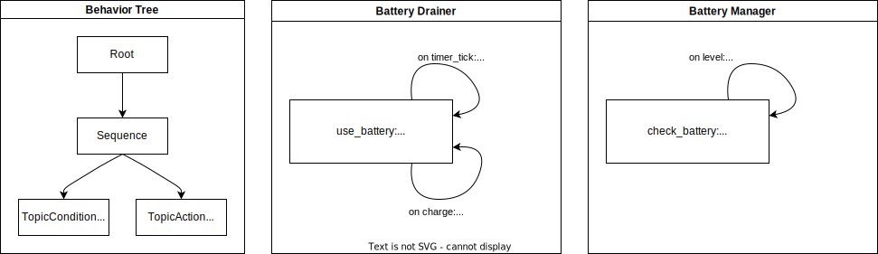

.. _scxml_conversion:

Quick Start
-----------

..

    How to convert from (SC)XML to plain JANI?

This tutorial explains how to convert an autonomous system specified using a combination of BT-XML and SCXML files into a JANI model.
For this tutorial, we assume the system specification is already available. Further explanations on how to specify the system can be found in the `SCXML How-To <scxml_howto>`.

Reference Model: Battery Drainer
`````````````````````````````````

For this tutorial, we use the model defined here: `quick_start_battery_monitor <https://github.com/convince-project/AS2FM/tree/main/examples/quick_start_battery_monitor>`_.
The model consists of a `main.xml` file, referencing the BT files running in the system and the SCXML files modeling the BT plugins, as well as the environment and the ROS nodes.

This example models a simple system with a battery that is continuously drained and, once it reaches a certain level, an alarm is triggered.
A behavior tree continuously monitors the alarm topic and, once it is triggered, recharges the battery to its full level before starting the draining process again.

The image below gives an overview of an exemplary system to be model-checked.



In this example, the system is composed by the following components modeled in SCXML:

* a **Battery Drainer**, that at each time step drains the battery by 1%, and each time the charge trigger is received, it recharges the battery to 100%.
* a **Battery Manager**, that at each time the battery level is received checks if it is below 30% and, if so, triggers the alarm.

The **Behavior Tree** continuously checks the alarm topic and, once it is triggered, sends a charge trigger to the battery drainer.

The JANI property `battery_charged` given in `battery_properties.jani <https://github.com/convince-project/AS2FM/blob/main/examples/quick_start_battery_monitor/battery_properties.jani>`_ defines the property of interest to be model-checked.
In this case, it calculates the minimal probability that the battery level will eventually be 100%, after an initial depletion time, i.e., all we verify here is that the battery is charged at some point.

In the `main.xml file <https://github.com/convince-project/AS2FM/blob/main/examples/quick_start_battery_monitor/main.xml>`_ introduced earlier, the maximum run time of the system is specified with ``max_time`` and shared across the components. To make sure that the model-checked property makes sense, the allowed runtime needs to be high enough to have enough time to deplete the battery, i.e., in this example the maximal time needs to be at least 100s because the battery is depleted by 1% per second. Further information about this and other configuration parameters can be found in the :ref:`Available Parameters section <mc_parameters>` of the :ref:`How-To page <howto>`.

In addition, in this main file, all the components of the example are put together, and the property to use is indicated.


Structure of Inputs
`````````````````````

The `as2fm_scxml_to_jani` tool takes a main XML file, e.g., `main.xml <https://github.com/convince-project/AS2FM/blob/main/examples/quick_start_battery_monitor/main.xml>`_ with the following content:

* one or multiple ROS nodes in SCXML:

    .. code-block:: xml

        <input type="ros-scxml" src="./battery_manager.scxml" />

* the environment model in SCXML:

    .. code-block:: xml

        <input type="ros-scxml" src="./battery_drainer.scxml" />

* the behavior tree in XML,
* the plugins of the behavior tree leaf nodes in SCXML,
* the property to check in temporal logic, currently given in JANI, later support for XML will be added:

    .. code-block:: xml

        <properties>
            <input type="jani" src="./battery_depleted.jani" />
        </properties>

* additionally, commonly shared variables for synchronization between the components are specified in the main file:

    .. code-block:: xml

        <mc_parameters>
            <max_time value="100" unit="s" />
        </mc_parameters>

All of those components are converted into one JANI DTMC model by the ``as2fm_scxml_to_jani`` tool.


Running the Script
`````````````````````

After installing the AS2FM packages as described in the :ref:`installation section <installation>`, a full system model can be converted into a model-checkable JANI file as follows:

.. sybil-new-environment: quick_start_battery_monitor
    :cwd: .
    :expected-files: examples/quick_start_battery_monitor/main.jani

.. code-block:: bash

    $ cd examples/quick_start_battery_monitor/; \
    $ as2fm_scxml_to_jani main.xml

    AS2FM - SCXML to JANI.

    Loading model from main.xml.
    xml_file='./battery_drainer.scxml'
    xml_file='./battery_manager.scxml'
    xml_file='./bt_topic_condition.scxml'
    xml_file='./bt_topic_action.scxml'
    ...

The output is a JANI file called `main.jani` that will be located in the same folder.

It can be checked with SMC Storm:

.. code-block:: bash

    $ cd examples/quick_start_battery_monitor/; \
    $ smc_storm --model main.jani --properties-names battery_depleted

    Welcome to SMC Storm
    Checking model: main.jani
    Property "battery_depleted": Pmin=? [F ((topic_level_msg__ros_fields__data <= 0) & topic_level_msg.valid)];
    Result: 0

This demonstrates that the battery will never be fully depleted.
