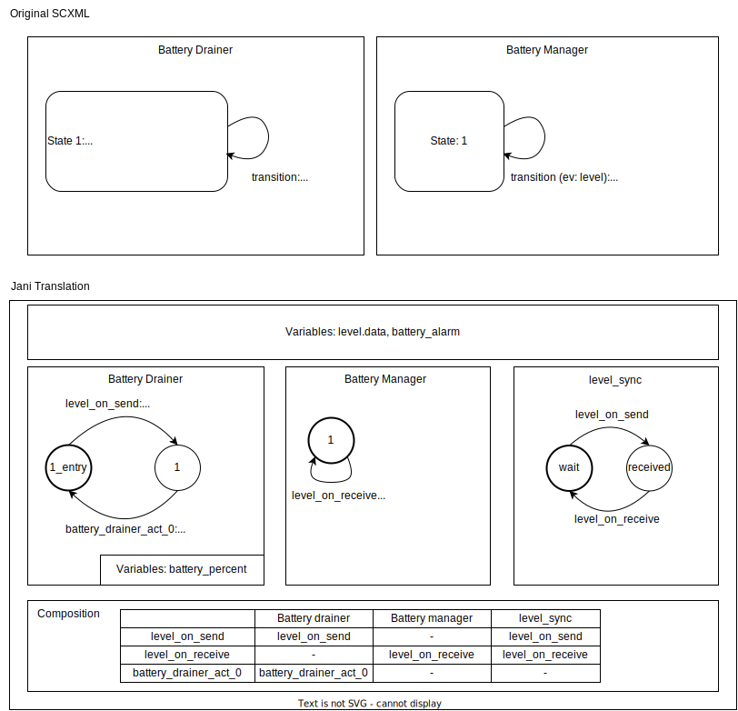
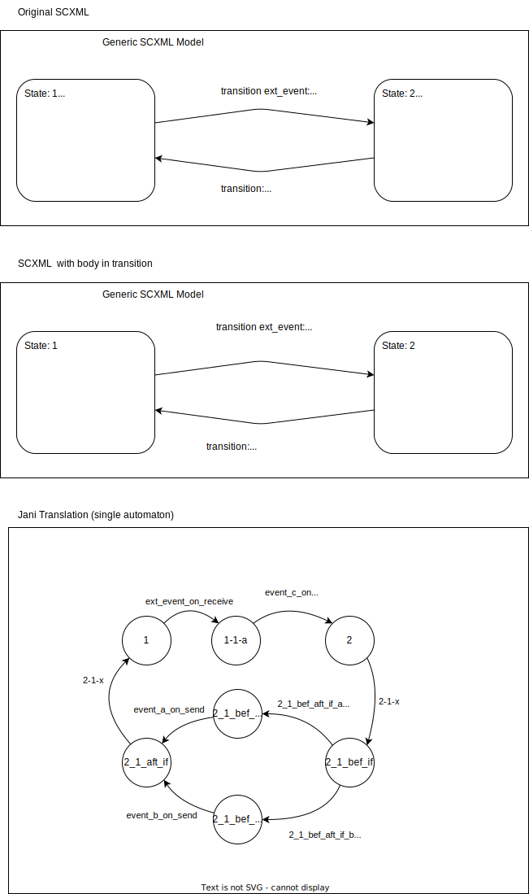
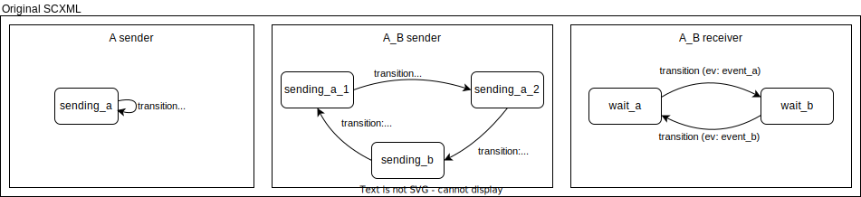

SCXML to JANI Conversion
========================

SCXML and JANI
----------------

In CONVINCE, we expect developers to use Behavior Trees and SCXML to model the different parts of a robotic systems.

SCXML (State Chart XML) is an XML format that describes a single state machine, and allows it to exchange information with other SCXML state machines using events. Each SCXML file defines its variables (datamodel), states, and transitions.

Using SCXML, the system can be modeled as a set of state machines, each one represented by an SCXML file, which are synchronized together using events. Operations are carried out when the execution of a state machine receives an event, enters a state, or exits a state.

Using AS2FM, we can convert the model described using SCXML to JANI, that is a JSON-based format for describing a system as a formal model. With JANI, the whole system model is contained in a single JSON file, consisting of a set of global variables, automata (equivalent to state machines) with their edges (equivalent to transitions), and a composition description, specifying how the automata should be synchronized by advancing specific edges at the same time synchronously.

The main difference between SCXML and JANI is that in JANI there is no concept of events, so synchronization must be achieved using the global variables and composition description.

High-Level (ROS) SCXML Implementation
---------------------------------------

In CONVINCE, we extended the standard SCXML format defined `here <https://www.w3.org/TR/scxml/>`_ with ROS and Behavior Tree (BT) specific features, to make it easier for robot developers to model their systems using both ROS and BT.

In this guide we will refer to the extended SCXML format as high-level SCXML and to the standard SCXML format as low-level SCXML.

Currently, the supported ROS-features are:

* ROS Topics
* ROS Timers (Rate-callbacks)
* ROS Service
* ROS Actions
* BT Ticks
* BT Responses
* BT Ports
* BT Blackboard

Low-Level SCXML Conversion
----------------------------

Low-Level SCXML is the standard SCXML format defined `here <https://www.w3.org/TR/scxml/>`_.

Our converter is able to transform High-Level (HL) SCXML to Low-Level (LL) SCXML by translating ROS and BT specific features to standard SCXML features.
This applies also for timers: we generate an additional SCXML FSM encoding a global clock, sending out events to trigger the timers defined in the model at the correct rate.

The next subsections describe our conversion strategy from HL-SCXML to LL-SCXML.
The entry-point for the conversion is implemented in ScxmlRoot.as_plain_scxml(). TODO: Link to API.

Handling of (ROS) Timers
__________________________

TODO

Handling of (ROS) Services
_____________________________

ROS services, as well as ROS topics, can be handled directly in the conversion from HL-SCXML to LL-SCXML.

The main structure of the SCXML related state machines can be inspected in the diagram below:

.. image:: graphics/ros_service_to_scxml.drawio.svg
    :alt: Handling of ROS Services
    :align: center

The automata of clients and services are converted directly from the existing ROS-SCXML files, while the "Extra Service Handler" is autogenerated starting from the provided clients' and services' declarations.

Handling of (ROS) Actions
_____________________________

ROS actions are handled similarly to ROS Services: a HL-SCXML description of the system is converted to LL-SCXML, and an additional automaton is generated to handle the synchronization between the clients and the server.

The structure of a client-server communication through actions and additional threads looks as follows:

.. image:: graphics/ros_action_to_scxml.drawio.svg
    :alt: Handling of ROS Actions
    :align: center

Handling the BT Blackboard
_____________________________

The Blackboard is a container that shares variables across different BT plugins. The value of those variables normally changes over time, and is expected to be updated at each tick.

In LL-SCXML, this is handled by an autogenerated SCXML FSM, that receives the updates from the various plugins and, upon request, provides the data.
This diagram summarizes the FSM structure.

Setting Blackboard Variables
~~~~~~~~~~~~~~~~~~~~~~~~~~~~~

This can be done using the tag `bt_set_output` in HL-SCXML. In LL-SCXML this translates to a send event, that is received by the Blackboard FSM to update the internal data.

Reading Blackboard Variables
~~~~~~~~~~~~~~~~~~~~~~~~~~~~~

At the current state, to read the internal variables there needs to be some message exchange between the plugin FSM and the Blackboard FSM.
This needs to happen for each and every Blackboard variable that is read.

Optimization is nevertheless possible (sending the whole set of blackboard variables each time), but this would diverge from the Blackboard.CPP implementation, so it should rather be an automatic conversion.

JANI Conversion
----------------

Once the low-level SCXML is obtained, we can use it together with the timer information in the conversion to a JANI model.

.. _simple_overview:

Simple Overview
________________

The following picture gives a simple overview of how the conversion works:

The core of the conversion lies in the translation of the SCXML state machines to JANI automata and the handling of the synchronization between them.
In the example above, we have two SCXML state machines, BatteryDrainer and BatteryManager, that are synchronized using the event "level".

At the start, the BatteryDrainer state machine sends a "level" event out, containing the current battery level in the "data" field.
In JANI, this translates to an edge, i.e., "level_on_send", that advances the BatteryDrainer automaton to a next state where the send action is carried out and, at the same time, assigns a global variable corresponding to the event parameter, i.e., "level.data", and another edge with the same name that advances an additional automaton "level_sync" from the "wait" to the "received" state, signaling that an event "level" was sent out and needs to be processed.

The BatteryManager automaton has an edge "level_on_receive", that can now be triggered since the "level_sync" automaton is in the "received" state. When executing the edge, the BatteryManager automaton assigns the global variable "battery_alarm" based on the data contained in the "level.data" variable and goes back to the same state, waiting for the next "level" event. Similarly, the "level_sync" automaton transitions back to the "wait" state using the edge "level_on_receive".

The BatteryDrainer can execute the edge "battery_drainer_act_0" and transition back to the initial state either before or after the "level_on_receive" action, as there is no constraint enforcing a specific order of execution.

It is important to notice that the level_sync automaton enforces the "level_on_receive" action to be execute before "level_on_send" can be executed again: this is to make sure the event is processed before sending the next event.

Though the approach described here works as it is in many cases, there are specific configurations that require special handling and will be discussed in the section :ref:`Handling Events<handling_events>`.

In the next sections we are going to describe in more detail how specific parts of the SCXML to JANI conversion are carried out.

Handling Onentry, Onexit, and Conditions
________________________________________

TODO

.. _handling_events:

Handling Events
________________

In section :ref:`Simple Overview<simple_overview>` we introduced the basic concept of how events are handled in the conversion from SCXML to JANI.
That concept works for the simplest cases, but there are more complex scenarios where problems may occur, and require special handling.

In order to understand possible problematic scenarios, let's consider the following example:

In this example there are two state machines that are sending `event_a` and `event_b` out and one state machine receiving them.
The first state machine sends `event_a` out at each loop, the second state machine sends `event_a` twice and `event_b` once before starting again and the third state machine receives `event_a` and `event_b` in alternating order.

If we use the event_sync automaton strategy as exemplified in the :ref:`Simple Overview<simple_overview>`, i.e., we make an automaton for syncing `event_a` and one for syncing `event_b` without any further handling, we will reach a deadlock situation where the `event_a` is waiting to be processed by the receiver before being able to send out `event_b`, but the receiver is waiting for `event_b` to be available before processing `event_a`.

In order to overcome such a situation, we need to introduce a mechanism that allows a receiver to discard an event it is not expecting, such that the senders can continue their execution.
This is achieved by tracking all events that an automaton can receive during its execution and, for each of its states, introducing a self loop transition processing the events that aren't explicitly handled.

An additional functionality to keep in mind during the conversion is the synchronization of the senders: if both senders are in a state where they can send out `event_a`, it is important that only one of them does it at a time: this will result in having one line for each automaton sending a specific event in the JANI composition table.

The JANI model resulting from applying the conversion strategies we just described is the following:

.. image:: graphics/scxml_to_jani_events_handling_pt2.drawio.svg
    :alt: Handling SCXML events preventing deadlocks in JANI
    :align: center

It can be seen how new self loop edges are added in the `A_B_receiver` automaton (the dashed ones) and how the `ev_a_on_send` is now duplicated in the composition table, one advancing the `A sender` automaton and the other one advancing the `A_B sender` automaton.
