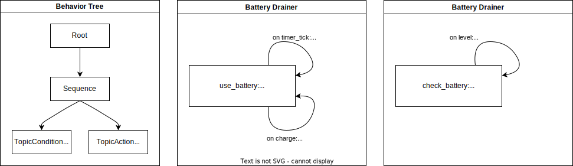

Tutorials
=========

This section provides tutorials on how to use the AS2FM tools to convert an autonomous robotic system into a formal model compatible with existing model checker tools (i.e., in the JANI format).

The page is subdivided in two main sections, one providing a :ref:`tutorial for converting an SCXML model into JANI <scxml_conversion>`, and the other one providing a :ref:`hands-on in-depth tutorial on a fetch and carry scenario including verification <full_tutorial>`.

The JANI models generated in the above tutorials with AS2FM can then be given to any model checker accepting JANI as an input format and being able to handle DTMC models. This could for example be the `Storm SMC extension SMC-STORM <https://github.com/convince-project/smc_storm>`_, which we developed as part of the CONVINCE toolchain. Check out the documentation of SMC-Storm for further details.
It can also be checked with external tools accepting JANI as input, e.g., the other engines of the `Storm model checker <https://stormchecker.org>`_ or the `Modest Toolset <https://modestchecker.net>`_.


Prerequisites
--------------

Before starting the tutorials, make sure to install AS2FM, as described in the :ref:`installation guide <installation>`.


.. _scxml_conversion:

Quick Guide: How to convert from (SC)XML to plain JANI?
---------------------------------------------------------

This tutorial explains how to convert an autonomous system specified using a combination of BT-XML and SCXML files into a JANI model.
For this tutorial, we assume the system specification is already available. Further explanations on how to specify the system can be found in the `SCXML How-To <scxml_howto>`.


Reference Model: Battery Drainer
`````````````````````````````````

For this tutorial, we use the model defined here: `ros_example_w_bt <https://github.com/convince-project/AS2FM/tree/main/test/jani_generator/_test_data/ros_example_w_bt>`_.
The model consists of a `main.xml` file, referencing to the BT files running in the system and the SCXML files modeling the BT plugins, as well as the environment and the ROS nodes.

This example models a simple system with a battery that is continuously drained and, once it reaches a certain level, an alarm is triggered.
A behavior tree continuously monitors the alarm topic and, once it is triggered, recharges the battery to its full level before starting the draining process again.

The image below gives an overview of an exemplary system to be model-checked.



In this example, the system is composed by the following components modeled in SCXML:

* a **Battery Drainer**, that at each time step drains the battery by 1%, and each time the charge trigger is received, it recharges the battery to 100%.
* a **Battery Manager**, that at each time the battery level is received checks if it is below 30% and, if so, triggers the alarm.

The **Behavior Tree** continuously checks the alarm topic and, once it is triggered, sends a charge trigger to the battery drainer.

The JANI property `battery_charged` given in `battery_properties.jani <https://github.com/convince-project/AS2FM/blob/main/test/jani_generator/_test_data/ros_example_w_bt/battery_properties.jani>`_ defines the property of interest to be model-checked.
In this case, it calculates the minimal probability that the battery level will eventually be 100%, after an initial depletion time, i.e., all we verify here is that the battery is charged at some point.

In the `main.xml file <https://github.com/convince-project/AS2FM/blob/main/test/jani_generator/_test_data/ros_example_w_bt/main.xml>`_ introduced earlier, the maximum run time of the system is specified with ``max_time`` and shared across the components. To make sure that the model-checked property makes sense, the allowed runtime needs to be high enough to have enough time to deplete the battery, i.e., in this example the maximal time needs to be at least 100s because the battery is depleted by 1% per second. Further information about this and other configuration parameters can be found in the :ref:`Available Parameters section <mc_parameters>` of the :ref:`How-To page <howto>`.

In addition, in this main file, all the components of the example are put together, and the property to use is indicated.


Structure of Inputs
`````````````````````

The `as2fm_scxml_to_jani` tool takes a main XML file, e.g., `main.xml <https://github.com/convince-project/AS2FM/blob/main/test/jani_generator/_test_data/ros_example_w_bt/main.xml>`_ with the following content:

* one or multiple ROS nodes in SCXML:

    .. code-block:: xml

        <input type="ros-scxml" src="./battery_manager.scxml" />

* the environment model in SCXML:

    .. code-block:: xml

        <input type="ros-scxml" src="./battery_drainer.scxml" />

* the behavior tree in XML,
* the plugins of the behavior tree leaf nodes in SCXML,
* the property to check in temporal logic, currently given in JANI, later support for XML will be added:

    .. code-block:: xml

        <properties>
            <input type="jani" src="./battery_depleted.jani" />
        </properties>

* additionally, commonly shared variables for synchronization between the components are specified in the main file:

    .. code-block:: xml

        <mc_parameters>
            <max_time value="100" unit="s" />
        </mc_parameters>

All of those components are converted into one JANI DTMC model by the ``as2fm_scxml_to_jani`` tool.


Running the Script
`````````````````````

After installing the AS2FM packages as described in the :ref:`installation section <installation>`, a full system model can be converted into a model-checkable JANI file as follows:

.. code-block:: bash

    cd AS2FM/jani_generator/test/_test_data/ros_example_w_bt/
    as2fm_scxml_to_jani main.xml

The output is a JANI file called `main.jani` that will be located in the same folder.


.. _full_tutorial:

Hands-on in-depth tutorial including verification: Fetch & Carry
-----------------------------------------------------------------

In this tutorial you will learn within around one hour how a fetch and carry robot scenario can be modeled in SCXML and how linear temporal logic properties can be verified on it. We translate the model of the robot and its environment with AS2FM into JANI for verification with SMC Storm, our statistical model checking tool.
We will observe fulfilled and violated properties. By updating the model with more involved functionality in terms of probabilistic behavior and features in the behavior tree we make in the end sure that all properties hold.

We assume some background in computer science or as a robotics developer but no knowledge about formal methods and model checking is required.

Reference Model: Fetch & Carry Robot
`````````````````````````````````````

For this tutorial we use the model defined here: `tutorial_fetch_and_carry <https://github.com/convince-project/AS2FM/tree/main/test/jani_generator/_test_data/tutorial_fetch_and_carry>`_.
What is implemented there is a classical fetch and carry task. A robot should drive to the pantry where food is stored, pick up snacks, drive to the table and place the snacks there. The robot should be done with this task after at most 100 seconds.

The model consists of a `main.xml` file, referencing to the BT `bt.xml` running in the system and the SCXML files modeling the BT plugins for navigating `bt_navigate_action.scxml`, picking `bt_pick_action.scxml`, and placing `bt_place_action.scxml`, as well as the world model `world.scxml`. Finally, there are the properties to check later with SMC Storm in the JANI format in `properties.jani`.

All of those components are summarized and collected in the `main.xml` file.
* First, some parameters configuring generic properties of the system are defined. In this example we bound the maximum execution time to 100 seconds, we configure unbounded arrays to contain at most 10 elements, and we configure the Behavior Tree to be ticked again in case it returns SUCCESS or FAILURE (by default, it would be tick for as long as it returns RUNNING, and stopped afterwards).

    .. code-block:: xml

        <mc_parameters>
            <max_time value="100" unit="s" />
            <max_array_size value="10" />
            <bt_tick_if_not_running value="true" />
        </mc_parameters>

* Afterwards the Behavior Tree is fully specified in terms of the BT in the BT.cpp XML format and the used BT plugins in SCXML. We will go into the details of the individual files later.

    .. code-block:: xml

        <behavior_tree>
            <input type="bt.cpp-xml" src="./bt.xml" />
            <input type="bt-plugin-ros-scxml" src="./bt_navigate_action.scxml" />
            <input type="bt-plugin-ros-scxml" src="./bt_pick_action.scxml" />
            <input type="bt-plugin-ros-scxml" src="./bt_place_action.scxml" />
        </behavior_tree>

* In addition, the model of the environment is given in SCXML. We will go into the details of the environment model later.

    .. code-block:: xml

        <node_models>
            <input type="ros-scxml" src="./world.scxml" />
        </node_models>

* In the end the properties are specified. We will go into the details of the checked property later.

    .. code-block:: xml

        <properties>
            <input type="jani" src="./properties.jani" />
        </properties>


The behavior tree specified in `bt.xml` looks as depicted in the first image below. The SequenceWithMemory node ticks each child in order until all of them have returned Success. Those who already returned Success are not ticked in the next cycle again.
The location is encoded as 0 = in the pantry and 1 = at the table. The snack object has id 0.

.. image:: graphics/scxml_tutorial_ros_fetch_and_carry_bt.drawio.svg
    :width: 800
    :alt: An image of the behavior tree of the fetch and carry example.

The second image depicts the behavior of the BT plugin `bt_navigate_action.scxml`. It is used to navigate to a certain location given by the id, either 0 or 1 in this example, stored in `data`. When the BT is ticked it assigns `loc_id = data`. When the BT is halted or the action is aborted `tmp_result` is set to false, otherwise it is set to true. Based on that the return status of the tree is then published.

The third image depicts the behavior of the BT plugin `bt_pick_action.scxml` in a very similar fashion. The action is used to pick a certain item with a given id, stored in `data`. When the BT is ticked it assigns `object_id = data`. When the BT is halted or the action is aborted `tmp_result` is set to false, otherwise it is set to true. Based on that the return status of the tree is then published.

The last image depicts the behavior of the BT plugin `bt_place_action.scxml`. When called, the action just immediately tries to successfully execute, no matter if there is an object in the gripper or not, when the BT is ticked. When the BT is halted or the action is aborted `tmp_result` is set to false, otherwise it is set to true. Based on that the return status of the tree is then published.

As a last step we are having a closer look at the environment model in `world.scxml`.

* First, it is indicated that the model makes use of dependencies from the `delib_ws_24_interfaces` package, where custom ROS actions are defined. In the last line the ROS topic publisher for the snack type is declared.

    .. code-block:: xml

        <ros_action_server name="act_nav" action_name="/go_to_goal" type="delib_ws_24_interfaces/Navigate" />
        <ros_action_server name="act_pick" action_name="/pick_object" type="delib_ws_24_interfaces/Pick" />
        <ros_action_server name="act_place" action_name="/place_object" type="delib_ws_24_interfaces/Place" />
        <ros_topic_publisher name="pub_snacks0" topic="/snacks0_loc" type="std_msgs/Int32" />

* The next block defines and initializes the variables used: An array of arrays of integers for the objects' locations, an integer for the robot's location, a flag indicating if the robot is holding something (-1 = no, otherwise the object's id), a variable saying where the object should be brought to, i.e., the `goal_id`, and a helper variable `tmp_idx`.

    .. code-block:: xml

        <datamodel>
            <data id="obj_locs" type="int32[1]" expr="[0]" />
            <data id="robot_loc" type="int32" expr="1" />
            <data id="robot_holding" type="int32" expr="-1" />
            <!-- Additional support variable for the goal_id -->
            <data id="goal_id" type="int32" expr="0" />
            <data id="tmp_idx" type="int32" expr="0" />
        </datamodel>

* The actual functionality of the world model is depicted in the graph below. When navigating to a goal the robot location is set to the goal location id. It is assumed that this operation always succeeds. When trying to pick an object it is checked if the object's location is the same as the robot's location. It is recorded in the `robot_holding` variable that the robot now holds the object with a certain id. The location of the object is reset to -1 indicating that it is in the robot's gripper. This procedure can succeed or be aborted. In case an object should be placed, it is checked if the robot is holding an object (by `robot_holding != -1`). In this case the location of the object is replaced with the robot's location and `robot_holding` is set to -1 again because the gripper is empty now. This procedure can also be aborted if it does not succeed.

    .. image:: graphics/scxml_tutorial_ros_fetch_and_carry_world.drawio.svg
        :width: 400
        :alt: An image of the world behavior of the fetch and carry example.


Model translation with AS2FM
```````````````````````````````

From this model in SCXML we can generate a JANI representation with AS2FM by executing:

.. code-block:: bash

    cd AS2FM/test/jani_generator/_test_data/tutorial_fetch_and_carry
    as2fm_scxml_to_jani main.xml

This produces the same model in JANI in the file `main.jani`.

Model Checking with SMC Storm
```````````````````````````````
We can now check with SMC Storm what the probability is that the snack will eventually be placed at the table This can be expressed as P_min(F topic_snacks0_loc_msg.ros_fields__data = 1 ∧ topic_snacks0_loc_msg.valid), where F is the finally operator of linear temporal logic (LTL) and the first operand of the logical and expresses that the snack is located at the table (id 1). The second operand is needed to make sure TODO.
The property is formulated in `properties.jani`.

This property can be checked by calling SMC Storm on the JANI file generated before with AS2FM. For more details on SMC Storm you can have a look the `SMC Storm repository <https://github.com/convince-project/smc_storm>`_.

Executing SMC Storm on this example works as follows:

.. code-block:: bash

    `smc_storm --model main.jani --properties-names snack_at_table --traces-file traces.csv --show-statistics`

The expected result shown below indicates that the property is fulfilled with probability 1, i.e., the snack is always successfully placed on the table. In this case model checking needed 500 traces to come to that result called with the default confidence and error parameters. The minimal length of a trace generated in those runs was 159 and the maximal length was 237.

.. code-block:: bash

    ============= SMC Results =============
        N. of times target reached:     500
        N. of times no termination:     0
        Tot. n. of tries (samples):     500
        Estimated success prob.:        1
        Min trace length:       159
        Max trace length:       237
    =========================================
    Result: 1

The changes of the values in the different ROS topics can be inspected by having a look at the log of the traces generated during model checking in `traces.csv`. A tool to inspect them graphically is PlotJuggler. Just run `ros2 run plotjuggler plotjuggler -d traces.csv` to open the graphical interface and pull the topic you want to inspect from the topic list into the coordinate system in the main inspection area. For the topic TODO this looks as in the picture below.

.. image:: graphics/plotjuggler.jpg
    :width: 800
    :alt: An image showing the changes of the topic TODO in plotjuggler.


Enhancing the Model with Probabilities
`````````````````````````````````````````

Enhancing the Behavior Tree to Handle Probabilistic Failures
```````````````````````````````````````````````````````````````
