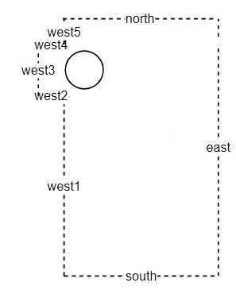
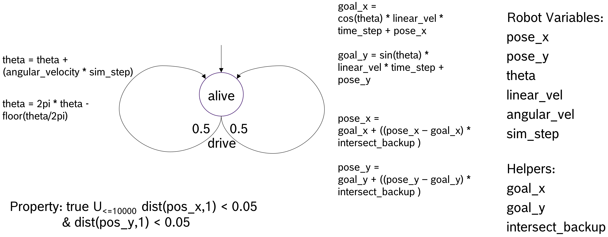

Tutorials
=========

This section provides tutorials on how to use the AS2FM tools to convert an autonomous robotic system into a formal model compatible with existing model checker tools (i.e. jani).

The page is subdivided in two main section, one providing a :ref:`tutorial for converting an SCXML model into jani <scxml_conversion>`, and the other one providing a :ref:`tutorial for converting a "CONVINCE robotic jani" model (plain) jani <jani_conversion>`.

The resulting JANI model from one of the approaches above can then be given to any model checker accepting JANI as an input format and being able to handle DTMC models. This could for example be the `Storm SMC extension smc-storm <https://github.com/convince-project/smc_storm>`_, which we developed as part of the CONVINCE toolchain. Check out the documentation of SMC Storm for further details.
It can also be checked with external tools accepting JANI as input, e.g., the other engines of the `Storm model checker <https://stormchecker.org>`_ or the `Modest Toolset <https://modestchecker.net>`_.


.. _scxml_conversion:

How to convert from (SC)XML to plain JANI?
--------------------------------------------

This tutorial explains how to convert an autonomous system specified using a combination of BT-XML and SCXML files into a JANI model.
For this tutorial, we assume the system specification is already available. Further explanations on how to specify the system can be found in the `SCXML how-to <scxml_howto>`.


Reference model
```````````````

For this tutorial, we use the model defined here: `ros_example_w_bt <https://github.com/convince-project/as2fm/tree/main/jani_generator/test/_test_data/ros_example_w_bt>`_.
The model consists of a main.xml file, referencing to the BT files running in the system and the SCXML files modeling the BT plugins, as well as the environment and the ROS nodes. 

This example models a simple system with a battery that is continuously drained and, once it reaches a certain level, an alarm is triggered.
A behavior tree continuously monitor the alarm topic and, once it is triggered, recharges the battery to its full level before starting the draining process again.

In this example, the system is composed by the following components modeled in SCXML:

* a **battery_drainer**, that at each time step drains the battery by 1%, and each time the charge trigger is received, it recharges the battery to 100%.
* a **battery_manager**, that at each time the battery level is received checks if it is below 30% and, if so, triggers the alarm.

The **behavior tree** continuously checks the alarm topic and, once it is triggered, sends a charge trigger to the battery_drainer.

The JANI property given in `battery_depleted.jani <https://github.com/convince-project/as2fm/tree/main/jani_generator/test/_test_data/ros_example/battery_depleted.jani>`_ defines the property of interest to be model checked. In this case, it calculates the minimal probability that the battery level is below or equal to zero eventually, i.e., all we verify here is that the battery is empty at some point.

In the `main.xml file <https://github.com/convince-project/as2fm/tree/main/jani_generator/test/_test_data/ros_example/main.xml>`_ introduced earlier, the maximum run time of the system is specified with ``max_time`` and shared across the components. To make sure that the model checked property makes sense, the allowed runtime needs to be high enough to have enough time to deplete the battery, i.e., in this example the maximal time needs to be at least 100s because the battery is depleted by 1% per second.
In addition, in this main file, all the components of the example are put together, and the property to use is indicated. 


Structure of input
`````````````````````

The `scxml_to_jani` tool takes a main XML file, e.g. `main.xml <https://github.com/convince-project/as2fm/tree/main/jani_generator/test/_test_data/ros_example/main.xml>`_ with the following content:

* one or multiple ROS nodes in SCXML:

    .. code-block:: xml

        <input type="ros-scxml" src="./battery_manager.scxml" />

* the environment model in SCXML:

    .. code-block:: xml

        <input type="ros-scxml" src="./battery_drainer.scxml" />

* the behavior tree in XML (to be implemented), 
* the plugins of the behavior tree leaf nodes in SCXML (to be implemented),
* the property to check in temporal logic, currently given in JANI, later support for XML will be added:

    .. code-block:: xml

        <properties>
            <input type="jani" src="./battery_depleted.jani" />
        </properties>

* additionally, commonly shared variables for synchronization between the components are specified in the main file:
  
    .. code-block:: xml

        <mc_parameters>
            <max_time value="100" unit="s" />
        </mc_parameters>

All of those components are converted into one JANI DTMC model by the ``scxml_to_jani`` tool.


Running the script
`````````````````````

After installing the AS2FM packages as described in the :ref:`installation section <installation>`, a full system model can be converted into a model-checkable JANI file as follows:

.. code-block:: bash

    cd AS2FM/jani_generator/test/_test_data/ros_example_w_bt/
    scxml_to_jani main.xml

The output is a JANI file will be located in the same folder, and it will be called `main.jani`.


.. _jani_conversion:

How to convert from CONVINCE robotic JANI to plain JANI?
-----------------------------------------------------------

We provide a Python script to convert models describing the system and its environment together, given in the CONVINCE robotics JANI flavor as specified in the `data model repository <https://github.com/convince-project/data-model>`_, into `plain JANI <https://jani-spec.org>`_ accepted as input by model checkers.

Running the script
```````````````````

After it has been installed, the script can be run on a CONVINCE robotics JANI model. It outputs a plain JANI conversion.

.. code-block:: bash

    convince_to_plain_jani --convince_jani path_to_convince_robotic_file.jani --output output_plain_file.jani


Example
`````````

Let's convert a first simple robotic JANI model. An example can be found in `here <https://github.com/convince-project/as2fm/blob/main/jani_generator/test/_test_data/convince_jani/first-model-mc-version.jani>`_. The environment model describes a room with three straight edges and one edge with a small corner in the middle. The room describing the environment in which the robot operates looks like this:



The lower left corner is at coordinates (0,0) and the upper right corner at coordinates (3,5). Lengths are given in meters, which means that the room has a dimension of 3x5 m with a corner of 0.5m at the top left. 
The robot is placed at coordinates (0.5, 0.5) initially, and has a round shape with a radius of 0.3 m and a height of 0.2 m. In the small and simple example there are no further obstacles and the robot drives with a linear and angular velocity of 0.5 m/s and 0.5 rad/s, respectively.

The behavior describing how the robot drives around in the room is modeled as a Deterministic Markov Chain (DTMC) shown in the picture below. In each step, the robot moves forward in 50% of the cases and rotates in 50% of the cases. In case it bumps into a wall, it just stops at the collision point and continues operating from there. What is omitted in the picture is the calculation of this collision point and the conversion to and from floats to integers. The latter is only necessary to make the example run in Storm because the tool currently does not support transient floats.



The property given in the JANI file checks for the minimal probability that eventually within 10 000 steps the position (1.0, 1.0) is reached with an error range of 0.05 m.
