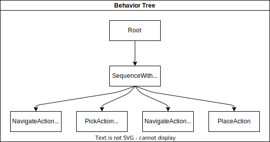

Tutorial
========

This section provides tutorials on how to use the AS2FM tools to convert an autonomous robotic system into a formal model compatible with existing model checker tools (i.e., in the JANI format).
The JANI models generated in the tutorials with AS2FM can be given to any model checker accepting JANI as input format and being able to handle DTMC models. This could for example be the `Storm SMC extension SMC-STORM <https://github.com/convince-project/smc_storm>`_, which we developed as part of the CONVINCE toolchain. Check out the documentation of SMC Storm for further details.
It can also be checked with external tools accepting JANI as input, e.g., the other engines of the `Storm model checker <https://stormchecker.org>`_ or the `Modest Toolset <https://modestchecker.net>`_.

Prerequisites
-------------

You don't need to install AS2FM and SMC Storm locally on your machine. You can directly use the docker container, in which all tools are preinstalled, provided as a package on the `AS2FM Github page <https://github.com/convince-project/AS2FM/pkgs/container/as2fm>`_

Just clone the repository and then run the following command in the root folder to start the docker in an interactive terminal such that you can then run all the commands in the tutorial inside the container.

.. code-block:: bash

    $ docker compose run -it --remove-orphans base bash

Then change to the following folder inside the container in which the files of the repository are mounted:

.. code-block:: bash

    $ cd /colcon_ws/src/as2fm/examples/tutorial_fetch_and_carry

In case you want to install AS2FM locally follow the description in the :ref:`installation guide <installation>`.

.. _full_tutorial:

What you will learn
-------------------

In this tutorial you will learn in about one hour how a robotic example can be expressed in SCXML.
The example models a robot with a simple symbolic fetch and carry task.
You will use linear temporal logic (LTL) properties to verify it is working correctly.
Then, you will translate the model of the robot and its environment with AS2FM into JANI to run it with `SMC Storm <https://github.com/convince-project/smc_storm>`_, our statistical model checking (SMC) tool.
With the results from SMC Storm, you will observe that some properties are fulfilled and some are violated.
By updating the model with more complexity in terms of probabilistic behavior and additional features in the behavior tree (BT), you make sure that the required properties hold in the end.
This verifies, that your BT controls the example correctly.

We assume some background in computer science or as a robotics developer but no knowledge about formal methods or model checking is required.

Reference Model: Fetch & Carry Robot
------------------------------------

For this tutorial we use the model defined here: `tutorial_fetch_and_carry <https://github.com/convince-project/AS2FM/tree/main/examples/tutorial_fetch_and_carry>`_.
A classical fetch and carry task is implemented there. A robot should drive to the pantry where food is stored, pick up snacks, drive to the table and place the snacks there. The robot should be done with this task after at most 100 seconds.

The model consists of a `main.xml <https://github.com/convince-project/AS2FM/blob/main/examples/tutorial_fetch_and_carry/main.xml>`_ file, referencing the BT `bt_tree.xml <https://github.com/convince-project/AS2FM/blob/main/examples/tutorial_fetch_and_carry/bt_tree.xml>`_ running in the system and the SCXML files modeling the BT plugins for navigating `bt_navigate_action.scxml <https://github.com/convince-project/AS2FM/blob/main/examples/tutorial_fetch_and_carry/bt_navigate_action.scxml>`_, picking `bt_pick_action.scxml <https://github.com/convince-project/AS2FM/blob/main/test/jani_generator/
_test_data/tutorial_fetch_and_carry/bt_pick_action.scxml>`__, and placing `bt_place_action.scxml <https://github.com/convince-project/AS2FM/blob/main/examples/tutorial_fetch_and_carry/bt_place_action.scxml>`_, as well as the world model `world.scxml <https://github.com/convince-project/AS2FM/blob/main/examples/tutorial_fetch_and_carry/world.scxml>`_. Finally, there is the property to check later with SMC Storm in JANI format in `properties.jani <https://github.com/convince-project/AS2FM/blob/main/examples/tutorial_fetch_and_carry/properties.jani>`_.

All of those components are summarized and collected in the `main.xml <https://github.com/convince-project/AS2FM/blob/main/examples/tutorial_fetch_and_carry/main.xml>`_ file.

* First, some parameters configuring generic properties of the system are defined. In this example we bound the maximum execution time to 100 seconds, and configure unbounded arrays to contain at most 10 elements.

    .. code-block:: xml

        <mc_parameters>
            <max_time value="100" unit="s" />
            <max_array_size value="10" />
        </mc_parameters>

* Afterwards the Behavior Tree is fully specified in terms of the BT in the BT.cpp XML format and the used BT plugins in SCXML for navigating, picking, and placing. We will go into the details of the individual files later.

    .. code-block:: xml

        <behavior_tree>
            <input type="bt.cpp-xml" src="./bt_tree.xml" />
            <input type="bt-plugin-ros-scxml" src="./bt_navigate_action.scxml" />
            <input type="bt-plugin-ros-scxml" src="./bt_pick_action.scxml" />
            <input type="bt-plugin-ros-scxml" src="./bt_place_action.scxml" />
        </behavior_tree>

* In addition, the model of the environment, also known as world, is given in SCXML. We will go into the details of the environment model later.

    .. code-block:: xml

        <node_models>
            <input type="ros-scxml" src="./world.scxml" />
        </node_models>

* In the end the properties are specified. We will go into the details of the checked property later.

    .. code-block:: xml

        <properties>
            <input type="jani" src="./properties.jani" />
        </properties>

The behavior tree specified in `bt_tree.xml <https://github.com/convince-project/AS2FM/blob/main/examples/tutorial_fetch_and_carry/bt_tree.xml>`_ looks as depicted in the image below. The SequenceWithMemory node ticks each child in order until all of them have returned Success. Those who already returned Success are not ticked in the next cycle again.
The location is encoded as 0 = in the pantry and 1 = at the table. The snack object has id 0.

The next image depicts the behavior of the BT plugin `bt_navigate_action.scxml <https://github.com/convince-project/AS2FM/blob/main/examples/tutorial_fetch_and_carry/bt_navigate_action.scxml>`_. It is used to navigate to a certain location given by the id, either 0 or 1 in this example, stored in `data`. When the BT is ticked it assigns `loc_id = data`. When the BT is halted or the action is aborted `tmp_result` is set to `false`, otherwise it is set to `true`. Based on that the return status of the tree is then published.

The next image depicts the behavior of the BT plugin `bt_pick_action.scxml <https://github.com/convince-project/AS2FM/blob/main/examples/tutorial_fetch_and_carry/bt_pick_action.scxml>`_ in a very similar fashion. The action is used to pick a certain item with a given id, stored in `data`. When the BT is ticked it assigns `object_id = data`. When the BT is halted or the action is aborted `tmp_result` is set to `false`, otherwise it is set to `true`. Based on that the return status of the tree is then published.

The next image depicts the behavior of the BT plugin `bt_place_action.scxml <https://github.com/convince-project/AS2FM/blob/main/examples/tutorial_fetch_and_carry/bt_place_action.scxml>`_. When called, the action just immediately tries to successfully execute, no matter if there is an object in the gripper or not, when the BT is ticked. When the BT is halted or the action is aborted `tmp_result` is set to `false`, otherwise it is set to `true`. Based on that the return status of the tree is then published.

As a last step we are having a closer look at the environment model in `world.scxml <https://github.com/convince-project/AS2FM/blob/main/examples/tutorial_fetch_and_carry/world.scxml>`_.

* First, it is indicated that the model makes use of the interfaces from the `fetch_and_carry_msgs <https://github.com/convince-project/AS2FM/tree/main/ros_support_interfaces/fetch_and_carry_msgs>`_ package, where custom ROS actions are defined. In line 21 the ROS topic publisher for the snack type is declared.

    .. code-block:: xml

        <ros_action_server name="act_nav" action_name="/go_to_goal" type="fetch_and_carry_msgs/Navigate" />
        <ros_action_server name="act_pick" action_name="/pick_object" type="fetch_and_carry_msgs/Pick" />
        <ros_action_server name="act_place" action_name="/place_object" type="fetch_and_carry_msgs/Place" />
        <ros_topic_publisher name="pub_snacks0" topic="/snacks0_loc" type="std_msgs/Int32" />

* The next block defines and initializes the variables used: An array of integers for the objects' locations, an integer for the robot's location, a flag indicating if the robot is holding something (-1 = no, otherwise the object's id), a variable saying where the object should be brought to, i.e., the `goal_id`, and two helper variables `req_obj_idx` and `req_loc_idx` for the id of the object which is requested to be picked up and the location to which the robot is requested to navigate to.

    .. code-block:: xml

        <datamodel>
            <data id="obj_locs" type="int32[1]" expr="[0]" />
            <data id="robot_loc" type="int32" expr="1" />
            <data id="robot_holding" type="int32" expr="-1" />
            <!-- Additional support variable for the goal_id -->
            <data id="goal_id" type="int32" expr="0" />
            <data id="req_obj_idx" type="int32" expr="0" />
            <data id="req_loc_idx" type="int32" expr="0" />
        </datamodel>

* The actual functionality of the world model is depicted in the graph below. When trying to navigate to a goal the location is first stored in the helper variable and from there the robot location is set to the goal location id.  For the moment, in this file it is assumed that this operation always succeeds. When trying to pick an object, the requested object's id is again stored in a helper variable. Afterwards, it is checked if the object's location is the same as the robot's location. It is recorded in the `robot_holding` variable that the robot now holds the object with a certain id. The location of the object is reset to -1 indicating that it is in the robot's gripper. This procedure can succeed or be aborted. In case an object should be placed, it is checked if the robot is holding an object (by `robot_holding != -1`). In this case the location of the object is replaced with the robot's location and `robot_holding` is set to -1 again because the gripper is empty now. This procedure can also be aborted if it does not succeed.

    .. image:: graphics/scxml_tutorial_ros_fetch_and_carry_world.drawio.png
        :width: 800
        :alt: An image of the world behavior of the fetch and carry example.

Model Translation with AS2FM
----------------------------

From this model in SCXML you can generate a JANI representation with AS2FM.
Assuming, you are in the ``examples/tutorial_fetch_and_carry`` folder:

.. sybil-new-environment: first_model_checking
    :cwd: examples/tutorial_fetch_and_carry
    :expected-files: main.jani, traces.csv

.. code-block:: bash

    $ as2fm_scxml_to_jani main.xml

    AS2FM - SCXML to JANI.

    Loading model from main.xml.
    xml_file='./world.scxml'
    xml_file='./bt_navigate_action.scxml'
    xml_file='./bt_pick_action.scxml'
    xml_file='./bt_place_action.scxml'
    ...

This produces the same model in the `JANI format <https://jani-spec.org/>`_ in the file `main.jani`.
You can find the expected sample output in `sample_solutions_and_outputs/reference_main.jani <https://github.com/convince-project/AS2FM/blob/main/examples/tutorial_fetch_and_carry/sample_solutions_and_outputs/reference_main.jani>`_.

Model Checking with SMC Storm
-----------------------------

We can now check with SMC Storm what the probability is that the snack will eventually be placed at the table. This can be expressed as ``P_min(F topic_snacks0_loc_msg.ros_fields__data = 1 ∧ topic_snacks0_loc_msg.valid)``, where F is the finally operator of `linear temporal logic (LTL) <https://en.wikipedia.org/wiki/Linear_temporal_logic>`_ and the first operand of the formula expresses that the snack is located at the table (id 1). The second operand is needed to make sure the system is still in a valid state.
The property is formulated in `properties.jani <https://github.com/convince-project/AS2FM/blob/main/examples/tutorial_fetch_and_carry/properties.jani>`_.

This property can be checked by calling SMC Storm on the JANI file generated before with AS2FM. For more details on SMC Storm you can have a look the `SMC Storm repository <https://github.com/convince-project/smc_storm>`_.

Executing SMC Storm on this example works as follows:

.. code-block:: bash

    $ smc_storm --model main.jani --properties-names snack_at_table --show-statistics

    Welcome to SMC Storm
    Checking model: main.jani
    Property "snack_at_table": Pmin=? [F ((topic_snacks0_loc_msg__ros_fields__data = 1) & topic_snacks0_loc_msg.valid)];

    ============= SMC Results =============
        N. of times target reached:	500
        N. of times no termination:	0
        Tot. n. of tries (samples):	500
        Estimated success prob.:	1
        Min trace length:	...
        Max trace length:	...
    =========================================
    Result: 1

The expected result shown above indicates that the property is fulfilled with probability 1, i.e., the snack is always successfully placed on the table. In this case model checking needed 500 traces to come to that result called with the default SMC confidence and error parameters. All generated traces terminated and the target, i.e., placing the stack at the table, was reached. The minimal length of a trace generated in those runs was 159 and the maximal length was 237.

It is also possible to log the traces generated during model checking in a csv file, i.e., store the evolution of state variable values, in this case the different ROS topics, during the trace generations. In the following only one trace is logged by using the `--max-n-traces` flag. Of course, also a higher number or even all traces can be chosen.

.. code-block:: bash

    $ smc_storm --model main.jani --properties-names snack_at_table --traces-file traces.csv --max-n-traces 1

    Welcome to SMC Storm
    Checking model: main.jani
    Property "snack_at_table": Pmin=? [F ((topic_snacks0_loc_msg__ros_fields__data = 1) & topic_snacks0_loc_msg.valid)];

One sample trace can be inspected in `reference_traces_single.csv <https://github.com/convince-project/AS2FM/blob/main/examples/tutorial_fetch_and_carry/sample_solutions_and_outputs/reference_traces_single.csv>`_.

A tool to inspect the changes in the variables graphically is `PlotJuggler <https://plotjuggler.io/>`_. Just run ``ros2 run plotjuggler plotjuggler -d traces.csv`` to open the graphical interface and pull the topic you want to inspect from the topic list into the coordinate system in the main inspection area. When opening the cvs file make sure to select "use row number as x-axis". With a right click on the plot you can select "Edit curve..." and then tick "Steps (pre)" to see a step-wise plot.

The visualization of the topics `world_robot_loc`, `world_robot_holding`, `world_obj_locs_at_0`, and `topic_clock_msg__ros_fields__sec` looks as follows:

You can see how the time advances in steps (`topic_clock_msg__ros_fields__sec`), how the robot moves from location 1 to 0 and then back to 1 again (`world_robot_loc`). The robot is first holding nothing, then it holds the object with id 0, and then it is holding nothing again (`world_robot_holding`). The objects position is first 0, then -1 in the gripper, and then 1 at the table (`world_obj_locs_at_0`).

Enhancing the Model with Probabilities
--------------------------------------

.. sybil-new-environment: enhancing
    :cwd: examples/tutorial_fetch_and_carry
    :expected-files: main_probabilistic.jani

This is a very simple example and behavior of the robot. In real world applications the item which should be brought to another location sometimes slips out of the gripper when trying to pick it. Let's say this happens in 40% of the trials. In addition, navigation fails sometimes, let's say in 30% of the cases. We would like to reflect this scenario by adapting the world model in `world_probabilistic.scxml <https://github.com/convince-project/AS2FM/blob/main/examples/tutorial_fetch_and_carry/world_probabilistic.scxml>`_. From now on we are using `main_probabilistic.scxml <https://github.com/convince-project/AS2FM/blob/main/examples/tutorial_fetch_and_carry/main_probabilistic.scxml>`_, which is the same as `main.scxml <https://github.com/convince-project/AS2FM/blob/main/examples/tutorial_fetch_and_carry/main.scxml>`_ but referencing this modified world model in line 15.

If you want to try to come up with a solution on your own on how to modify the world model such that its results are probabilistic, try to fill the gaps flagged with `TODO` (sometimes in comments, sometimes directly in the code) in the file `world_probabilistic_gaps.scxml <https://github.com/convince-project/AS2FM/blob/main/examples/tutorial_fetch_and_carry/world_probabilistic_gaps.scxml>`_. Afterwards you can read on here and compare your solution with ours in `world_probabilistic.scxml <https://github.com/convince-project/AS2FM/blob/main/examples/tutorial_fetch_and_carry/world_probabilistic.scxml>`_.

`world_probabilistic.scxml` differs from the previous world model by introducing success probabilities for navigating and picking. Placing the object works as before. For navigating the requested goal location is first stored and the model transitions into the `handle_nav_request` state for handling the navigation request. From there the new location is assigned successfully in 70% of the cases. In the remaining 30% the request is not fulfilled and the action is aborted.

Similarly for the picking action, the object's id is first stored in a helper variable and the model transitions into the `handle_pick_request` state for handling the picking request. With a probability of 60% the action succeeds as before. Otherwise, it is aborted. This time the remaining part is not explicitly specified in line 88, because in such cases the remaining probability is implicitly assumed.

Graphically this new functionality is visualized below:

.. image:: graphics/scxml_tutorial_ros_fetch_and_carry_world_probabilistic.drawio.png
    :width: 800
    :alt: An image of the world behavior with probabilities.

You can then run SMC Storm again on the modified model after generating the JANI model with AS2FM.

.. code-block:: bash

    $ as2fm_scxml_to_jani main_probabilistic.xml && \
      smc_storm --model main_probabilistic.jani --properties-names snack_at_table --show-statistics

    ...

.. code-block::

    ============= SMC Results =============
        N. of times target reached:	4607
        N. of times no termination:	0
        Tot. n. of tries (samples):	15600
        Estimated success prob.:	0.2953205128
        Min trace length:	65
        Max trace length:	252
    =========================================
    Result: 0.2953205128

The expected result shown above indicates that the property is not fulfilled with probability 1 anymore, i.e., the snack is not always successfully placed on the table, because it can slip out of the gripper when trying to pick it up, or the navigation fails.
This gives us a probability of 0.7 * 0.6 * 0.7 = 0.294 that everything works successfully (navigate to the item, pick it, navigate to the table).
In this case model checking needed 15700 traces to come to the result that the task is only completed successfully in 29.99% of the cases, which is in the confidence (0.95) and error bound (0.1) of the default configuration of SMC Storm.

The sample output for one trace can be found again in `sample_solutions_and_outputs/reference_traces_prob_single.csv <https://github.com/convince-project/AS2FM/blob/main/examples/tutorial_fetch_and_carry/sample_solutions_and_outputs/reference_traces_prob_single.csv>`_. We do not provide the full output because it is quite large.

The changes of the values in the different ROS topics can be inspected by having a look at the log of the traces generated during model checking again by running ``ros2 run plotjuggler plotjuggler -d reference_traces_prob_single.csv``. Here we checked exemplarily a trace in `reference_traces_prob_single.csv`, which shows a failing trace, where the robot navigates to the pantry successfully but then never manages to grasp the object and thus also never transports it to the table. Keep in mind that the traces generated in every call to SMC Storm differ from previous runs because they are regenerated taking the probabilities into account, i.e., the traces you generate on your machine may differ.

Enhancing the Behavior Tree to Handle Probabilistic Failures
------------------------------------------------------------

.. sybil-new-environment: enhancing_bt
    :cwd: examples/tutorial_fetch_and_carry
    :expected-files: main_probabilistic_extended_bt.jani

When the picking action does not succeed because the item slips out of the gripper, or the navigation fails for some reason, we actually would like that the robot executes a recovery strategy, i.e., it tries to pick the item again, or tries to navigate at the requested location again.
Can you come up with one or more solutions for that on your own? In the following, we will discuss one of them.

One solution is to realize the functionality in the behavior tree by adding a `RetryUntilSuccessful` node in line 3 of the modified behavior tree in `bt_tree_retry.xml <https://github.com/convince-project/AS2FM/blob/main/examples/tutorial_fetch_and_carry/bt_tree_retry.xml>`_:

.. code-block:: xml

    <RetryUntilSuccessful num_attempts="5">

This also allows to specify the number of attempts to retry. The new behavior tree looks as depicted below:

We can again run SMC Storm on the modified model after generating the JANI model with AS2FM. This time we use `main_probabilistic_extended_bt.xml <https://github.com/convince-project/AS2FM/blob/main/examples/tutorial_fetch_and_carry/main_probabilistic_extended_bt.xml>`_ as input to refer to the modified files of the bt and the probabilistic world model.

.. code-block:: bash

    $ as2fm_scxml_to_jani main_probabilistic_extended_bt.xml && \
      smc_storm --model main_probabilistic_extended_bt.jani --properties-names snack_at_table --show-statistics

    ...

The expected result shown below states that the property is now fulfilled with probability 95.05% again when 5 retries are allowed.

.. code-block::

    ============= SMC Results =============
        N. of times target reached:     3802
        N. of times no termination:     0
        Tot. n. of tries (samples):     4000
        Estimated success prob.:        0.9505
        Min trace length:       181
        Max trace length:       519
    =========================================
    Result: 0.9505

As before an inspection with PlotJuggler can be helpful.

Summary
-------

Congratulations! You finished the tutorial on how to use AS2FM and SMC Storm on a fetch & carry use case. You learned how to generate a JANI model out of (SC)XML models of a BT, its BT plugins, and a world model with AS2FM. You successfully checked a temporal logic property on it and inspected the changes in the ROS topic variables during sample executions of the model produced by the model checker with PlotJuggler. Afterwards, you modified the example such that the behavior of the navigation and picking actions is probabilistic. In the end you even introduced a recovery strategy in case of failures in the BT.

We hope that you got a better understanding of how to use AS2FM and SMC Storm on your own systems now.
